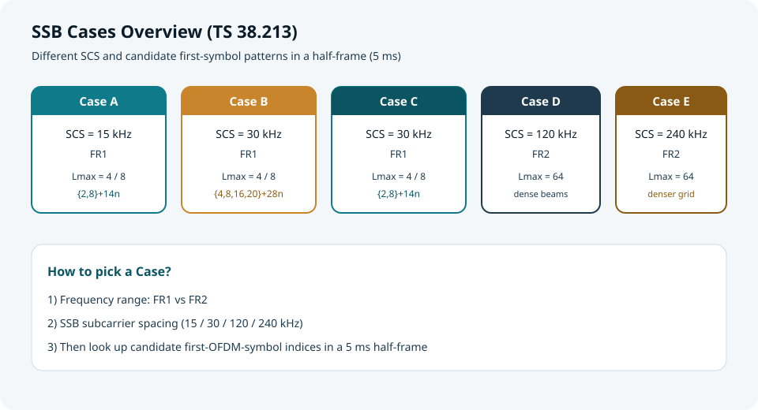
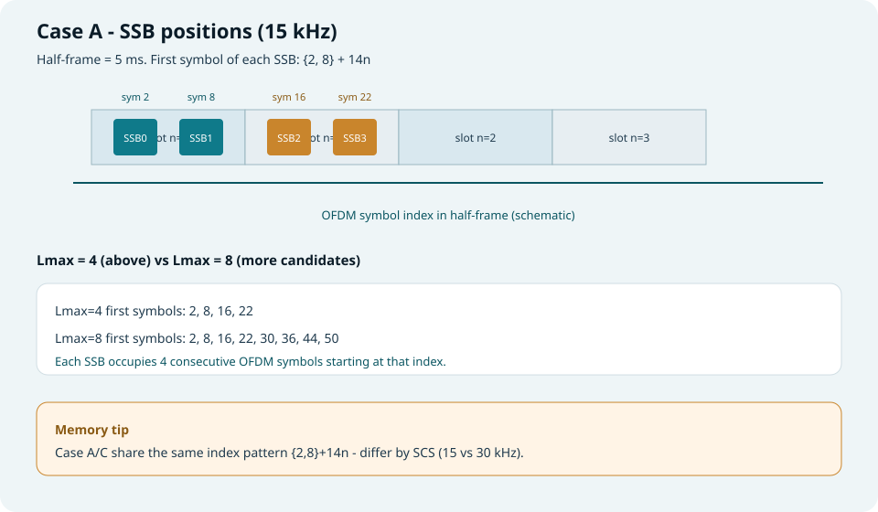
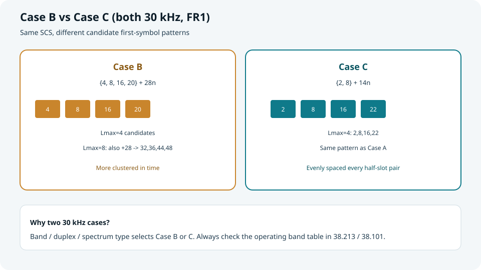
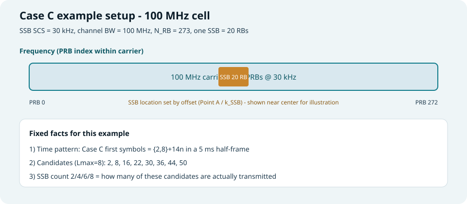
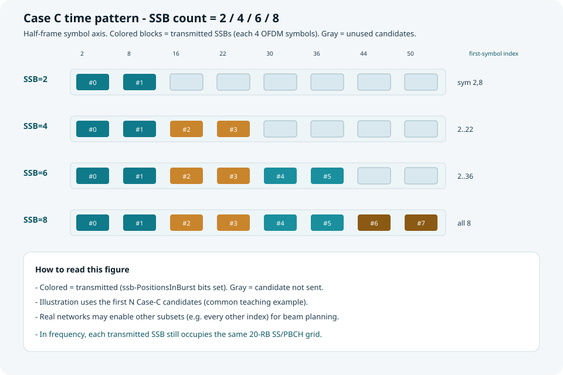
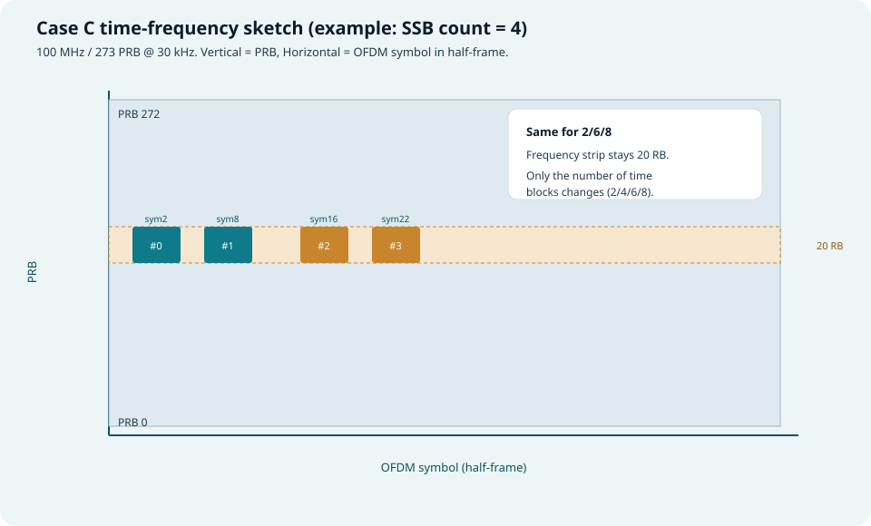
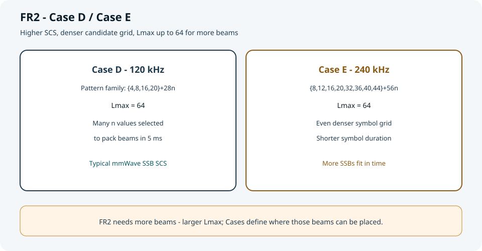
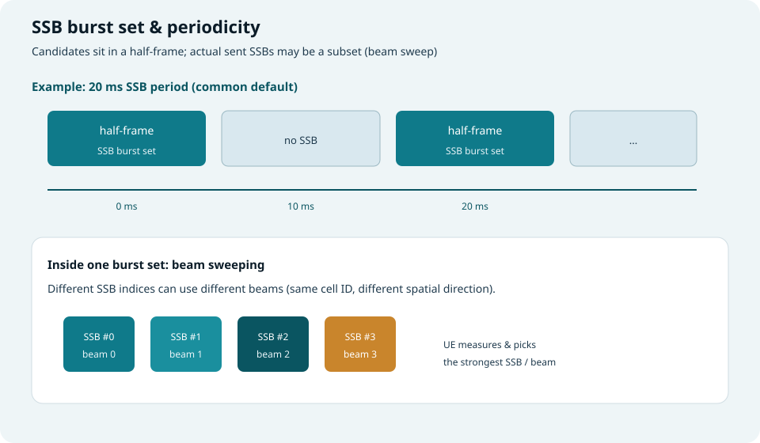

## 本篇要解决什么

上一篇讲了 **一个 SSB 内部** 的时频结构（PSS/SSS/PBCH）。  
本篇回答：**网络在半帧里把 SSB 放在哪些符号上？不同频段/SCS 有哪些 Case？**

对照规范：**TS 38.213 §4.1 Cell search**。



*图：先按 FR1/FR2 与 SCS 选 Case，再查候选起始符号*

---

## 先抓住三个词

| 概念 | 含义 |
| --- | --- |
| **Half-frame（半帧）** | 5 ms；SSB 候选位置都按“半帧内 OFDM 符号编号”给出 |
| **Lmax** | 半帧内最多可配置的 SSB 个数（候选上限） |
| **SSB period** | 实际发送 SSB 突发集的周期（常见 20 ms，也可 5/10/40/80/160 ms） |

> 规范给出的是**候选位置**；实际只发其中一部分（`ssb-PositionsInBurst`），用于波束扫描。

---

## Case 对照总表

| Case | SSB SCS | 典型频段 | 候选起始符号公式（半帧内） | Lmax |
| --- | --- | --- | --- | --- |
| **A** | 15 kHz | FR1 | `{2, 8} + 14n` | 4 / 8 |
| **B** | 30 kHz | FR1 | `{4, 8, 16, 20} + 28n` | 4 / 8 |
| **C** | 30 kHz | FR1 | `{2, 8} + 14n` | 4 / 8 |
| **D** | 120 kHz | FR2 | `{4, 8, 16, 20} + 28n`（n 取一组指定值） | 64 |
| **E** | 240 kHz | FR2 | `{8, 12, 16, 20, 32, 36, 40, 44} + 56n` | 64 |

每个 SSB 本身仍占 **4 个连续 OFDM 符号**（相对该起始符号为 0…3）。

---

## Case A（15 kHz，FR1）

**公式**：起始符号 = `{2, 8} + 14n`

| Lmax | n 取值 | 起始符号列表 |
| --- | --- | --- |
| 4 | 0, 1 | 2, 8, 16, 22 |
| 8 | 0…3 | 2, 8, 16, 22, 30, 36, 44, 50 |



*图：半帧内 Case A 候选位置；每个色块 = 一个 SSB（4 符号）*

**记忆**：15 kHz 下一帧有 10 个时隙；`14n` 正好对齐时隙节奏，每个时隙可放“靠前 / 靠后”一对候选。

---

## Case B 与 Case C（都是 30 kHz）

两者 SCS 相同，**候选图案不同**——由工作频段/双工类型决定用哪一种。

### Case B

起始符号 = `{4, 8, 16, 20} + 28n`

| Lmax | 起始符号（示意） |
| --- | --- |
| 4 | 4, 8, 16, 20 |
| 8 | 再加 32, 36, 44, 48 |

### Case C

起始符号 = `{2, 8} + 14n`（与 Case A **同图案**，但 SCS=30 kHz）

| Lmax | 起始符号 |
| --- | --- |
| 4 | 2, 8, 16, 22 |
| 8 | 2, 8, 16, 22, 30, 36, 44, 50 |



*图：同为 30 kHz，B 更“成簇”，C 与 A 同索引图案*

**易混点**：看到 30 kHz 不要直接猜 Case——要查该频段在规范表中对应 **B 还是 C**。

---

## Case C 深挖：100 MHz 小区，SSB 个数 = 2 / 4 / 6 / 8

下面用一个**可落地的参数组合**把 Case C 讲清楚。

### 参数设定（示例）

| 项目 | 取值 | 说明 |
| --- | --- | --- |
| Case | **C** | FR1，SSB SCS = **30 kHz** |
| 小区带宽 | **100 MHz** | 查 TS 38.101-1：30 kHz 下 **N_RB = 273** |
| 单个 SSB 频域 | **20 RB** | 240 子载波 / 12 = 20 RB（与个数无关） |
| 半帧候选起始符号 | 2, 8, 16, 22, 30, 36, 44, 50 | `{2,8}+14n`，Lmax=8 |
| SSB 个数 2/4/6/8 | 实际发送个数 | 由 `ssb-PositionsInBurst` 决定 |

> **关键分离**：频域上 SSB 始终是那条 20 RB 的“窄条”；个数变化主要体现在**时域里点亮多少个候选块**。



*图：100 MHz / 273 PRB 载波上，SSB 占 20 RB（位置由 Point A / k_SSB 等偏移决定，图中居中仅作示意）*

### 时域：个数 2 / 4 / 6 / 8 怎么落点

教学示例按“**取 Case C 前 N 个候选**”点亮（工程上也可选其他子集）：

| SSB 个数 | 示意点亮的 SSB 索引 | 起始符号（Case C） |
| --- | --- | --- |
| **2** | #0, #1 | 2, 8 |
| **4** | #0…#3 | 2, 8, 16, 22 |
| **6** | #0…#5 | 2, 8, 16, 22, 30, 36 |
| **8** | #0…#7 | 2, 8, 16, 22, 30, 36, 44, 50 |



*图：灰块 = 候选未发；彩块 = 实际发送。半帧内最多 8 个候选，个数越多波束机会越多*

### 时频合看（以 SSB=4 为例）

把“频域 20 RB 条带”和“时域 4 个起始符号”叠在一张示意里：



*图：纵轴 PRB（0…272），横轴半帧 OFDM 符号；4 个色块同一频域条带、不同时间位置*

对 **SSB=2/6/8**：频域条带不变，只是色块数量变成 2/6/8（对应上表起始符号）。

### 为什么 100 MHz 仍只占 20 RB？

- 小区带宽决定 **PDSCH/BWP 能调度多宽**（这里约 273 RB）。  
- SSB 是同步/广播的**固定栅格**（20 RB），不随小区带宽变宽而变宽。  
- 因此：带宽越大，SSB 在频域上越像“载波里的一条窄同步带”。

### 工程记忆卡

```text
Case C + 100 MHz @ 30 kHz
  频域：273 PRB 载波里放 20 RB SSB
  时域：候选 {2,8,16,22,30,36,44,50}
  个数：PositionsInBurst 点亮其中 2/4/6/8 个
  每个点亮块：仍是 4 个连续 OFDM 符号
```

---

## Case D / E（FR2）

毫米波需要更多波束 → **Lmax 可达 64**，候选网格更密。

| Case | SCS | 图案直觉 |
| --- | --- | --- |
| **D** | 120 kHz | 与 Case B 同族 `{4,8,16,20}+28n`，但 n 取值更多 |
| **E** | 240 kHz | `{8,12,16,20,32,36,40,44}+56n`，符号更短、可塞更多 SSB |



*图：FR2 用更高 SCS + 更大 Lmax 支撑波束扫描*

---

## 周期、突发集与波束

候选位置解决“**能放在哪**”；周期与 bitmap 解决“**实际发哪些、隔多久发一次**”。



*图：20 ms 周期示例；突发集内不同 SSB 索引可对应不同波束*

要点：

1. **SSB period**：MIB/SIB 相关配置，常见默认 20 ms。  
2. **ssb-PositionsInBurst**：指示半帧内哪些候选真正发送。  
3. **SSB index**：UE 测到强 SSB → 获知时间索引与优选波束，进入后续接入。

---

## 学习路线图（建议按此背）

```text
频段 FR1 / FR2
    ↓
SSB SCS（15 / 30 / 120 / 240）
    ↓
选定 Case A–E
    ↓
半帧内起始符号列表（+ 每块 4 符号）
    ↓
Lmax 与 PositionsInBurst（实际发哪些）
    ↓
Period（多久重复一组突发）
```

---

## 快速自测

1. Case A 与 Case C 有什么相同、有什么不同？  
2. Case B 的 Lmax=4 起始符号是哪四个？  
3. 为什么 FR2 的 Lmax 往往远大于 FR1？  
4. “候选位置”和“实际发送的 SSB”差在哪一层配置？

> 一句话：**Case 决定半帧里 SSB 的候选落点；周期与 bitmap 决定波束怎么扫、隔多久扫一次。**

## 相关专题

- [5G 帧结构与 SS/PBCH Block](frame-structure-ssb.html)（SSB 内部 PSS/SSS/PBCH 映射）
