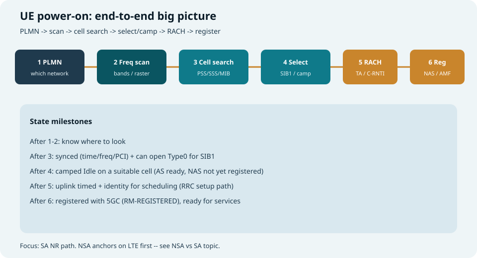
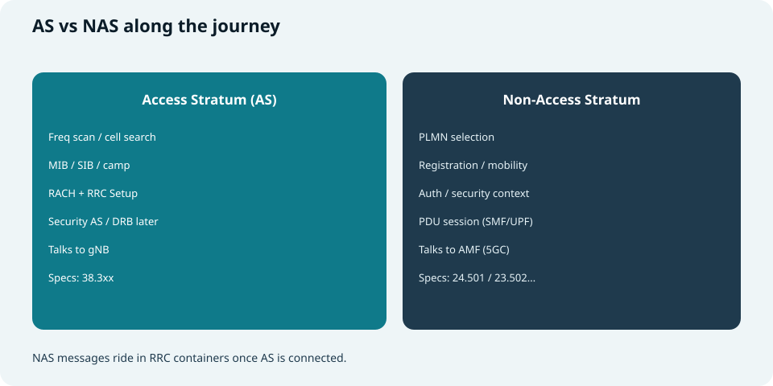
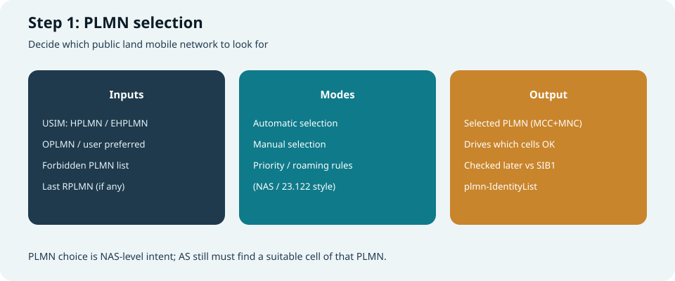
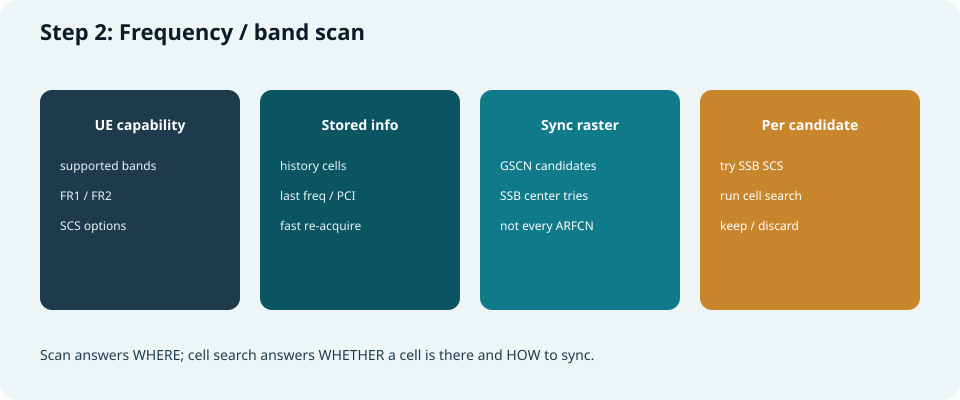
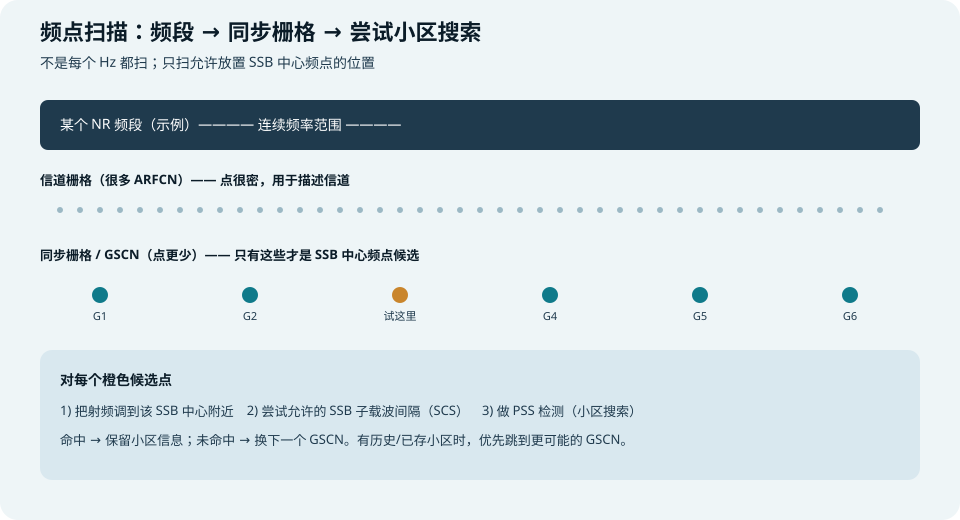
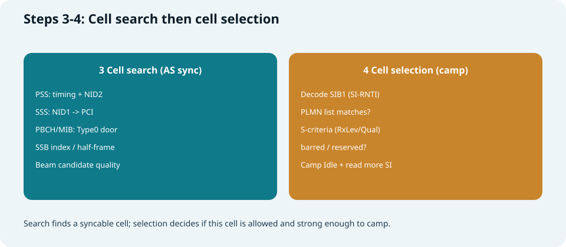
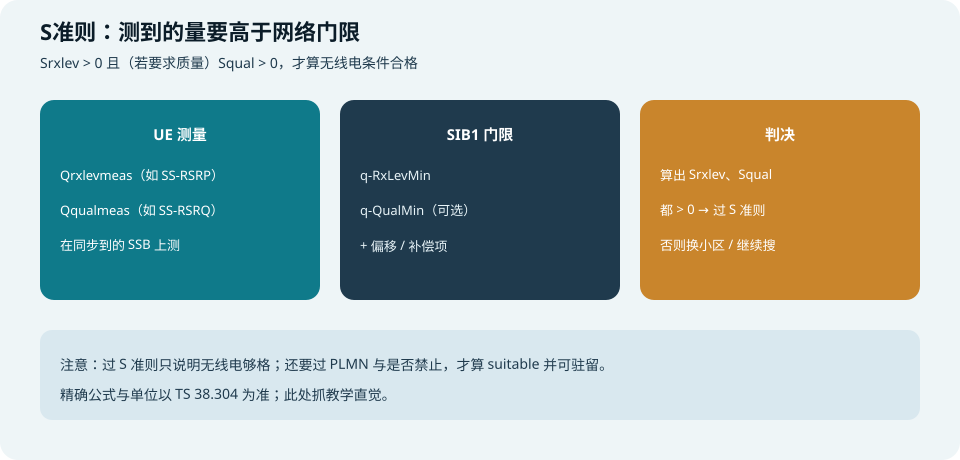
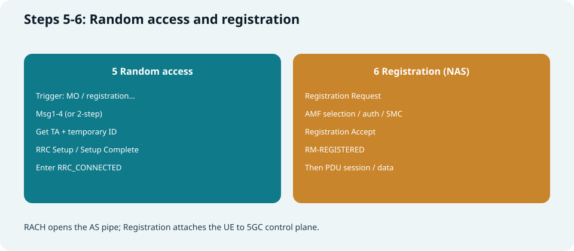

## 本篇要解决什么

站内已有小区搜索、SIB、CORESET、随机接入、RRC 等专题。本篇做一件事：

**把「UE 开机 → 能用上网」收成一条主线**，按你熟悉的步骤巩固：

1. **PLMN 选择**  
2. **频点扫描**  
3. **小区搜索**  
4. **小区选择（驻留）**  
5. **随机接入**  
6. **注册（及之后）**

默认讲 **SA NR**（直连 5GC）。NSA 会先挂 LTE，见 [NSA 与 SA](nsa-vs-sa.html)。

对照直觉规范：**23.122**（PLMN）、**38.304**（选择/重选）、**38.213/38.331**（搜网与 AS）、**38.321**（RACH）、**24.501 / 23.502**（注册）。  
相关：[小区搜索](cell-search.html)、[SSB Cases](ssb-cases-positions.html)、[5G SIBs](5g-sibs.html)、[CORESET 与 Search Space](coreset-search-space.html)、[随机接入](random-access.html)、[NR RRC](nr-rrc-reconfiguration.html)、[5G NR 架构](5g-nr-architecture.html)。



*图：六步主线 + 每步结束后 UE「多知道了什么」*

---

## 一张表先建立全局

| 步骤 | 核心问题 | 主要产物 | 失败时常见表现 |
| --- | --- | --- | --- |
| **PLMN 选择** | 找哪家网络？ | 目标 PLMN（MCC+MNC） | 一直漫游搜错网、禁网 |
| **频点扫描** | 去哪些频点听？ | 候选 band / GSCN | 扫很久、漏频段 |
| **小区搜索** | 有没有可同步小区？ | 定时、PCI、MIB | 无服务、同步不稳 |
| **小区选择** | 这个小区能不能住？ | Idle 驻留 + SIB | 有同步但不驻留 |
| **随机接入** | 怎么被网络点名？ | TA、C-RNTI、RRC 连接 | Msg1/2/3/4 卡死 |
| **注册** | 核心网认不认我？ | RM-REGISTERED | 附着/注册拒绝 |

> 口诀：**选网 → 扫频 → 同步 → 驻留 → 敲门 → 挂号。**

---

## AS 与 NAS：两条线别缠死



*图：空口侧（AS）对 gNB；核心网侧（NAS）对 AMF*

| | **AS（接入层）** | **NAS（非接入层）** |
| --- | --- | --- |
| 对手 | **gNB** | **AMF**（及后续 SMF 等） |
| 本流程里 | 扫频、搜网、SIB、RACH、RRC | PLMN、注册、鉴权、会话 |
| 状态直觉 | Idle 驻留 / Connected | RM-DEREGISTERED / REGISTERED |

常见误区：

- 「搜到小区」≠「已注册」——中间还差 RACH + NAS 注册  
- 「RRC Connected」≠「一定有 PDU Session」——注册成功后还常要再建会话才有用户面数据  

---

## 第 1 步：PLMN 选择



*图：USIM/优先级/禁网列表 → 选出目标 PLMN*

### 在干什么

NAS 决定：**优先尝试哪一个公共陆地移动网**。

### 输入从哪来

| 来源 | 例子 |
| --- | --- |
| **USIM** | HPLMN、EHPLMN、运营商优选列表 |
| **用户** | 手动选网 |
| **历史** | 上次 RPLMN（若仍可用） |
| **限制** | Forbidden PLMN（曾被拒绝等） |

### 模式

- **自动选网**：按优先级与漫游规则自己找  
- **手动选网**：用户指定 PLMN，再只搜属于它的小区  

### 和后面的衔接

真正是否「属于该 PLMN」，要等读到 **SIB1 的 `plmn-IdentityList`** 才能核对。  
选网是 **意图**；小区选择是 **落地验证**。

---

## 第 2 步：频点扫描（展开）



*图：能力 + 历史 + 同步栅格 → 逐个候选做小区搜索*

很多人对这一步懵，是因为名字像「把频谱从头扫到尾」，但实际是：

> **在「SSB 允许出现的那些中心频点」上，逐个试：这里有没有灯塔（PSS）？**

真正「看见灯塔、读出 PCI/MIB」是第 3 步小区搜索；本步只负责 **列出并排队要试的坐标**。



*图：band 很宽；channel raster 很密；sync raster / GSCN 才是开机搜 SSB 的候选点*

---

### 2.1 先建立画面：灯塔与地图

| 比喻 | 对应 |
| --- | --- |
| 整片海域 | 某个 **NR Band** 的频率范围 |
| 灯塔 | **SSB**（里面有 PSS/SSS/PBCH） |
| 灯塔只许建在规定码头 | **同步栅格（sync raster）** / **GSCN** |
| 你开船去每个规定码头看有没有灯 | **频点扫描** |
| 到码头后用望远镜找灯、对时 | **小区搜索（PSS…）** |

所以：  
- **不是** 在 3.5 GHz 附近每一个 Hz 上做相关；  
- **而是** 按规范给出的稀疏候选点去试，试完一个换下一个。

---

### 2.2 三个容易混的词

| 名词 | 它管什么 | 开机搜网时你怎么用 |
| --- | --- | --- |
| **Band（频段）** | 一大段合法工作频率（如 n78） | 先缩小「去哪片海」——只扫 UE **能力声明支持**、且与选网策略相关的 band |
| **Channel raster / NR-ARFCN** | 信道中心可落的细密栅格 | 描述「载波/信道」位置时用；**候选点极多**，不适合无脑全扫做初始搜网 |
| **Sync raster / GSCN** | **SSB 中心**允许落的栅格 | **初始搜网主菜单**：SSB 只会出现在这些点上（或与之对应的频率） |

记住一句：

> **找小区同步信号，跟的是 sync raster（GSCN）；不是把所有 ARFCN 扫一遍。**

（驻留之后，系统消息还会告诉你更多「精确信道/载波」信息；那是「已经找到灯塔之后」的事。）

---

### 2.3 UE 手里有什么，决定怎么扫

扫描不是随机乱撞，输入通常包括：

| 输入 | 作用 |
| --- | --- |
| **UE RF 能力** | 支持哪些 band、FR1/FR2、哪些 SSB SCS |
| **USIM / 选网结果** | 为哪个 PLMN 服务；可能影响优先 band 列表（实现/运营相关） |
| **历史信息** | 上次成功的频点、PCI、band——**优先重访**（快得多） |
| **实现策略** | 先扫高优先级 band、交错扫、后台扫等（芯片/协议栈产品行为） |

两条路径对比：

```text
冷启动（没什么历史）
  → 按能力 band 列表
  → 每 band 展开 sync raster 上的 GSCN 候选
  → 逐个做小区搜索试探
  → 慢，但覆盖全

暖启动 / 回到原服务区
  → 先试 stored cell / last frequency
  → 很快同步则缩短扫描
  → 失败再退回较全的扫描
```

---

### 2.4 一个候选频点上，UE 实际在干什么

对 **某一个 GSCN 对应的 SSB 中心频率**，大致循环是：

```text
1. 射频调谐到该中心附近（本振落到候选频率）
2. 选择一种允许的 SSB SCS（如 FR1 常见 15 或 30 kHz）
3. 在此时频假设下跑 PSS 相关（进入「小区搜索」）
4. 若相关峰够好 → 认为「这里可能有小区」，继续 SSS/PBCH…
5. 若不行 → 换另一种 SCS 再试；仍不行 → 下一个 GSCN
```

要点：

- **同一频率坐标**，可能要因 **SCS 不同** 试不止一次（SSB 的子载波间隔不同，时频结构不同）。  
- 扫描层负责 **换坐标 / 换 SCS 假设**；相关峰与解码是搜索层的工作——概念上分成两步，实现里常常紧耦合在一个「搜网状态机」里。

---

### 2.5 和「小区搜索」怎么划界（避免再混）

| | **频点扫描** | **小区搜索** |
| --- | --- | --- |
| 问题 | **去哪些频率试？** 试的顺序？ | **这个频率上有没有 SSB？** 定时/PCI/MIB？ |
| 输出 | 候选列表 + 当前试到哪一个 | 同步结果或失败 |
| 失败意味 | 列表扫完仍无可用小区 → 无服务/换 band | 当前候选没灯塔 → 扫下一个 |

一句话：

> **扫描 = 点名点花名册；搜索 = 对到号的人做身份核验。**

---

### 2.6 FR1 / FR2 为何体感差很多

| | **FR1** | **FR2** |
| --- | --- | --- |
| 频率 | 较低 | mmWave，更高 |
| 扫描空间 | band 多但仍相对「好扫」 | 波束窄，常要 **方向/波束** 一起搜 |
| 体感 | 主要是「换频点 + 换 SCS」 | 还可能「换波束方向」，时间更敏感 |
| 和后面关系 | SSB Case、波束索引仍重要 | 搜网质量更绑在 **SSB 波束** 上 |

因此 FR2 上「扫频」往往不是纯一维频率问题，而是 **频率 × 空间** 的搜索——细节仍落在 SSB/波束专题。

---

### 2.7 小例子（教学用假数）

假设 UE 只开了 **n78**，冷启动：

1. 确定：只在 n78 的 sync raster 上取 GSCN 列表（假说有 \(N\) 个候选）。  
2. 若有历史：先试「上次的 GSCN + SCS」。  
3. 否则从优先级最高的候选开始：  
   - 试 SCS=30 kHz → PSS 无峰  
   - 再试 SCS=15 kHz → 仍无  
   - 换下一个 GSCN……  
4. 某次 PSS 峰很强 → **频点扫描命中**，交给小区搜索把 SSS/MIB 做完。  
5. 若整表扫完都无峰 → 该 band 无网；换下一 band 或报无服务。

你不需要背 \(N\) 是多少；要建立的是：**候选是离散的、可枚举的，且优先用历史缩短枚举。**

---

### 2.8 排障时怎么想到「扫频」

| 现象 | 更像扫频问题还是搜索问题 |
| --- | --- |
| 很久才搜到、耗电大 | 冷扫描范围大、历史无效、band 太多 |
| 某地永远无服务，邻机正常 | 能力缺 band、扫表被裁、禁网/选网导致不扫该 PLMN 的频 |
| 固定频点仪表有 SSB，终端搜不到 | 终端没把该 GSCN 放进候选（能力/策略），或 SCS 假设不对 |
| 一靠近原小区就秒连 | 历史频点命中（暖启动）——说明扫描策略在起作用 |

深挖时频结构与 Case：[小区搜索](cell-search.html)、[SSB Cases](ssb-cases-positions.html)、[帧结构与 SSB](frame-structure-ssb.html)。规范侧栅格细节见 **TS 38.104 / 38.101** 中 channel / sync raster 相关条款（本篇抓直觉即可）。

---

## 第 3 步：小区搜索（同步）



*图：左半边是搜索同步；右半边是选择驻留*

### 在干什么

对每个候选频点，把未知量变成已知量：

| 子步骤 | 拿到什么 |
| --- | --- |
| **PSS** | 符号定时 + NID⁽²⁾ |
| **SSS** | NID⁽¹⁾ → **PCI** |
| **PBCH / MIB** | 帧/半帧信息、**`pdcch-ConfigSIB1`**（打开 Type0 找 SIB1） |
| **SSB 索引 / 波束** | 时间位置与可用波束质量 |

### 成功标志（AS）

- 时间、频率大致锁定  
- 知道 PCI  
- 能按 MIB 去监听 **Type0-PDCCH**，准备收 **SIB1**  

此时仍可能 **还不能驻留**（未验证 PLMN、S 准则、是否禁止接入等）。

深挖：[小区搜索](cell-search.html)、[CORESET 与 Search Space](coreset-search-space.html)、[5G SIBs · MIB](5g-sibs.html)。

---

## 第 4 步：小区选择与驻留（Camp）

### 在干什么

读 **SIB1**（及必要其它 SI），判断该小区是否 **suitable**，通过则 **Idle 驻留**。

小区搜索只回答「**同步得上吗**」；本步回答「**这家小区允不允许、值不值得住**」。

### SIB1 里本步最关心的

| 信息 | 用途 |
| --- | --- |
| **plmn-IdentityList** | 是否属于第 1 步选的 PLMN（或可接受的等效） |
| **TAC** | 跟踪区，供注册/寻呼域使用 |
| **cellSelectionInfo**（如 q-RxLevMin 等） | **S 准则**：电平/质量够不够 |
| **cellAccessRelatedInfo** | 禁止接入、保留小区等 |
| **RACH / 公共 BWP 等** | 为下一步随机接入准备 |

细节见 [5G SIBs](5g-sibs.html)；准则框架见 **TS 38.304**。

---

### S 准则详解（本步核心备注）



*图：测量值 − 门限与补偿 → 得到 S；S 要大于 0*

#### 1) S 准则在回答什么

**S 准则（cell selection criterion S）** 判断：在当前测量下，这个小区的 **无线电条件是否合格**。

| 通过 | 不通过 |
| --- | --- |
| 电平（及要求时的质量）相对门限有余量 | 太弱 / 质量太差，不适合作为服务小区候选 |

它 **不管**「是不是你的 PLMN」「小区禁不禁止」——那些是并列的其它条件。  
学习时把 suitable 想成：

```text
suitable ≈ 归属/接入允许 + 过 S 准则（+ 规范要求的其它条件）
```

#### 2) 两个量：\(S_{\mathrm{rxlev}}\) 与 \(S_{\mathrm{qual}}\)

规范用两个「余量」说话（名字即 selection rx level / quality）：

| 符号 | 含义 | 直觉 |
| --- | --- | --- |
| **\(S_{\mathrm{rxlev}}\)** | 接收电平余量 | 「比最低能听门限高出多少」 |
| **\(S_{\mathrm{qual}}\)** | 接收质量余量 | 「比最低质量门限高出多少」（若网络要求质量） |

**判决直觉（教学版）：**

\[
S_{\mathrm{rxlev}} > 0
\quad\text{且}\quad
S_{\mathrm{qual}} > 0
\]

才算满足 S 准则。  
若 SIB1 **未配置**质量相关门限（如无 `q-QualMin`），则往往 **不强制** \(S_{\mathrm{qual}}\)（以 **38.304** 当前条款为准）；实操排障时先看 SIB1 到底有没有广播质量门限。

#### 3) 公式直觉（不必死背系数，要会拆项）

教学形式（具体偏移/补偿项以 38.304 为准）：

\[
S_{\mathrm{rxlev}}
=
Q_{\mathrm{rxlevmeas}}
-
\bigl(Q_{\mathrm{rxlevmin}} + Q_{\mathrm{rxlevminoffset}}\bigr)
-
P_{\mathrm{compensation}}
-
Q_{\mathrm{offsettemp}}
\]

\[
S_{\mathrm{qual}}
=
Q_{\mathrm{qualmeas}}
-
\bigl(Q_{\mathrm{qualmin}} + Q_{\mathrm{qualminoffset}}\bigr)
-
Q_{\mathrm{offsettemp}}
\]

| 符号 | 从哪来 | 备注 |
| --- | --- | --- |
| **\(Q_{\mathrm{rxlevmeas}}\)** | UE **测量** | 常用 **SS-RSRP**（在同步到的 SSB 上测） |
| **\(Q_{\mathrm{qualmeas}}\)** | UE **测量** | 常用 **SS-RSRQ**（若走质量） |
| **\(Q_{\mathrm{rxlevmin}}\)** | SIB1：`q-RxLevMin` | 「最低接收电平」门限 |
| **\(Q_{\mathrm{qualmin}}\)** | SIB1：`q-QualMin`（可选） | 「最低质量」门限 |
| **\(Q_{\mathrm{rxlevminoffset}}\) / \(Q_{\mathrm{qualminoffset}}\)** | 规范/配置中的偏移 | 例如更高优先级 PLMN 搜索等场景可能抬高要求 |
| **\(P_{\mathrm{compensation}}\)** | 由功率能力等算出 | 直觉：UE 最大发射能力相对网络假设偏弱时，等价于要求更高下行余量（细节见 38.304） |
| **\(Q_{\mathrm{offsettemp}}\)** | 临时偏移 | 如临时惩罚/偏移（若适用） |

> 口诀：**测到的 − 网络门限 − 补偿/临时项 = S；S 要压在 0 以上。**

#### 4) 和 SIB1 字段怎么对上号

挂在 **`cellSelectionInfo`**（及可能的扩展）里，常见：

| RRC 字段（名随 ASN.1） | 对应直觉 |
| --- | --- |
| **q-RxLevMin** | \(Q_{\mathrm{rxlevmin}}\)：电平底线 |
| **q-QualMin** | \(Q_{\mathrm{qualmin}}\)：质量底线（可选） |
| **q-RxLevMinSUL** 等 | SUL 场景另有一套电平门限（若配置） |

单位与量化步长（例如每步对应多少 dB）以 **38.331 / 38.304** 为准；读日志时不要把「ASN 整型」直接当 dBm 口算，要按规范换算。

#### 5) 放在整步判决里的位置

对一个已同步、已读 SIB1 的小区，典型检查顺序（教学）：

```text
1. PLMN 是否可接受（列表匹配 / 等效）
2. 小区是否禁止、保留给运营商等（接入相关）
3. S 准则：Srxlev（及需要时 Squal）> 0
4. 其它 38.304 要求的条件
   → 全部过：suitable → 可 Camp Idle
   → S 不过：换波束/换小区/继续搜，即使同步很好也「不住」
```

因此日志里常见：

- **同步 OK、MIB/SIB1 OK，但 camp 失败** → 优先查 **Srxlev/Squal 与门限**、以及禁小区/PLMN。

#### 6) 与小区重选的关系（防混）

| | **小区选择 + S 准则** | **小区重选** |
| --- | --- | --- |
| 何时 | 开机、丢服务后重新找可住小区等 | **已经住下**之后找更好的 |
| S 的角色 | 「够不够格住」 | 重选另有 **R 准则** 等比较邻区；服务小区也常要维持可接受的 S |
| 目标 | 尽快找到 **suitable** | 在合适集合里优化 |

#### 7) 小例子（假数，只为建立感觉）

假设（已换算到同一 dB 量纲）：

- 测得 \(Q_{\mathrm{rxlevmeas}} = -90\)  
- \(Q_{\mathrm{rxlevmin}}= -100\)，偏移与补偿合计 \(= 2\)  

则  
\(S_{\mathrm{rxlev}} = -90 - (-100) - 2 = 8 > 0\) → **电平项通过**。  
若同时要求质量且 \(S_{\mathrm{qual}} \le 0\) → **整条 S 准则仍失败**。

---

### 选择 vs 重选（巩固）

| | **小区选择** | **小区重选** |
| --- | --- | --- |
| 何时 | 开机、丢服务后重新找网等 | 已驻留后，找更好小区 |
| 目标 | 尽快找到 **可驻留** 小区 | 在合适集合里优化 |

### 成功标志

- 驻留在某小区 Idle  
- 知道「我在哪个 TAC / 听哪个寻呼」的基础信息  
- **尚未**完成核心网注册（除非之前上下文仍有效且实现走快速路径——学习时先按完整注册理解）

---

## 第 5 步：随机接入（RACH）



*图：左：敲开空口连接；右：向 5GC 挂号*

### 为什么现在才做

Idle 驻留下，UE 通常还缺：

- 可靠的 **上行 Timing Advance（TA）**  
- 专属 **C-RNTI**  
- 一次被网络承认的 **上行发送机会**  

业务/注册触发后，走 **CBRA（竞争随机接入）** 最常见。

### 四步直觉（巩固）

| 消息 | 作用 |
| --- | --- |
| **Msg1** | PRACH preamble：敲门 |
| **Msg2** | RAR：给 TA、UL grant、临时身份 |
| **Msg3** | RRC Setup Request 等：自报家门 |
| **Msg4** | 竞争解决 + RRC Setup |

之后常见：

`RRC Setup Complete`（可捎带 NAS）→ 进入 **RRC_CONNECTED**，并继续安全、配置。

深挖：[随机接入](random-access.html)、[Power Control · PRACH](nr-power-control.html)、[NR RRC](nr-rrc-reconfiguration.html)。

---

## 第 6 步：注册（Registration）

### 在干什么

NAS 向 **AMF** 发起 **Registration**（初始注册最典型），完成：

- 身份与鉴权  
- 安全模式（NAS / AS 安全激活顺序以实现与规范为准）  
- 注册接受：分配临时身份、允许的 NSSAI/切片相关信息等  
- UE 进入 **RM-REGISTERED**

RRC 常作为 **NAS 容器**：`dedicatedNAS-Message` 里塞 Registration Request / Accept 等。

### 和「能上网」的关系

| 完成度 | 含义 |
| --- | --- |
| 仅驻留 | 能听系统消息 / 寻呼准备，**未**对核心网挂号 |
| RRC Connected + 未注册完 | 空口连着，核心网事务未完成 |
| **注册成功** | 控制面在网；**用户面**通常还要 **PDU Session 建立** 才有 DN 数据 |

切片场景下，注册还会带上期望切片信息，见 [网络切片](network-slicing.html)。

架构位置：[5G NR 架构](5g-nr-architecture.html)。

---

## 端到端串讲（建议背这一段）

```text
开机
 → NAS 选 PLMN
 → 按 band / sync raster 扫频
 → 每候选：PSS → SSS → PBCH/MIB
 → Type0 收 SIB1
 → 核对 PLMN + S 准则 + 接入限制 → Camp Idle
 →（注册/起呼等）触发 RACH Msg1..4
 → RRC Setup / Setup Complete（可带 NAS）
 → Registration 与鉴权/安全
 → RM-REGISTERED
 →（通常）PDU Session → 传数据
```

波束世界补充：搜网阶段选的是 **SSB 波束**；连接后还会用 CSI-RS / SRS 等精细化，见 [CSI-RS](nr-csi-rs.html)、[SRS](nr-srs.html)、[Massive MIMO](massive-mimo-beamforming.html)。

---

## 状态机对照（巩固用）

| 阶段末 | RRC 直觉 | NAS 直觉 |
| --- | --- | --- |
| 扫频中 | — | 选网/搜网中 |
| 搜到并解 MIB | 仍未驻留 | 仍未注册 |
| 小区选择成功 | **Idle 驻留** | 多仍为 DEREGISTERED |
| RACH + Setup 成功 | **Connected** | 注册可能进行中 |
| Registration Accept | Connected（或随后 Inactive，视策略） | **REGISTERED** |

（Inactive 是注册后省电态，本篇主线先抓 Idle → Connected → Registered。）

---

## 排障：卡在哪一层

| 现象 | 优先怀疑落在哪一步 |
| --- | --- |
| 完全无服务、扫不停 | 频点扫描 / 能力频段 / 同步栅格 |
| 有能量峰但无 PCI/MIB | 小区搜索（PSS/SSS/PBCH） |
| 有 MIB 无 SIB1 | Type0 CORESET/SS、SI-RNTI |
| 有 SIB1 不驻留 | PLMN 不匹配、S 准则、小区禁止 |
| 驻留后上不了网 | RACH 失败、注册拒绝、无 PDU Session |
| Msg1 无 Msg2 | RO/功率/PL、RA-RNTI 窗口 |
| 注册被拒 | 签约、切片、禁网、身份/鉴权 |

分层日志口诀：**先 AS 后 NAS；先同步后驻留；先 RACH 后注册。**

---

## 快速自测

1. 用一句话区分：频点扫描 vs 小区搜索 vs 小区选择。  
2. 为什么初始搜网跟 sync raster / GSCN，而不是把所有 NR-ARFCN 扫一遍？  
3. Band、channel raster、sync raster 各回答什么问题？  
4. 同一个 GSCN 候选上，为什么还可能要试多种 SSB SCS？  
5. 为什么「解出 MIB」还不能叫已经驻留？  
6. \(S_{\mathrm{rxlev}}\)、\(S_{\mathrm{qual}}\) 各表示什么？和 `q-RxLevMin` / `q-QualMin` 怎么联系起来？  
7. SIB1 里哪三类信息分别服务 PLMN、S 准则、后续 RACH？  
8. RACH 主要补齐 UE 的哪两样空口能力？  
9. RRC Connected 是否等于已经 Registration 成功？是否等于能传上网数据？  
10. AS 与 NAS 在本流程中各自对谁说话？  
11. SA 与 NSA 开机主线差在哪一刀？  

---

## 一句话

**开机搜网 = NAS 选对 PLMN → AS 在同步栅格上找到并同步小区 → 用 SIB1 通过选择准则驻留 → RACH 建立 RRC 连接 → NAS 向 AMF 注册；前半段解决「听得见、住得下」，后半段解决「连得上、挂得了号」。**

### 站内延伸（按学习顺序）

1. [小区搜索](cell-search.html)  
2. [SSB Cases](ssb-cases-positions.html) / [帧结构与 SSB](frame-structure-ssb.html)  
3. [5G SIBs](5g-sibs.html)  
4. [CORESET 与 Search Space](coreset-search-space.html)  
5. [随机接入](random-access.html)  
6. [NR RRC 与 RRCReconfiguration](nr-rrc-reconfiguration.html)  
7. [NSA 与 SA](nsa-vs-sa.html) · [5G NR 架构](5g-nr-architecture.html)  
